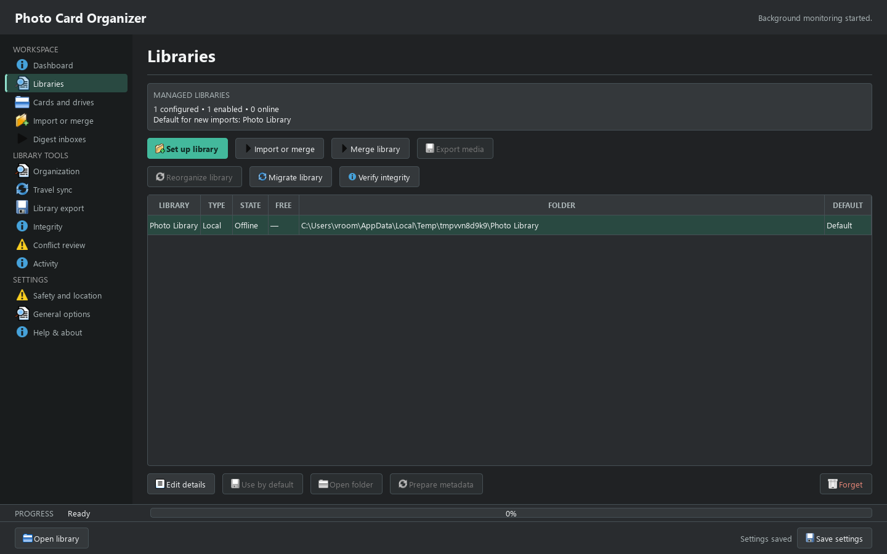
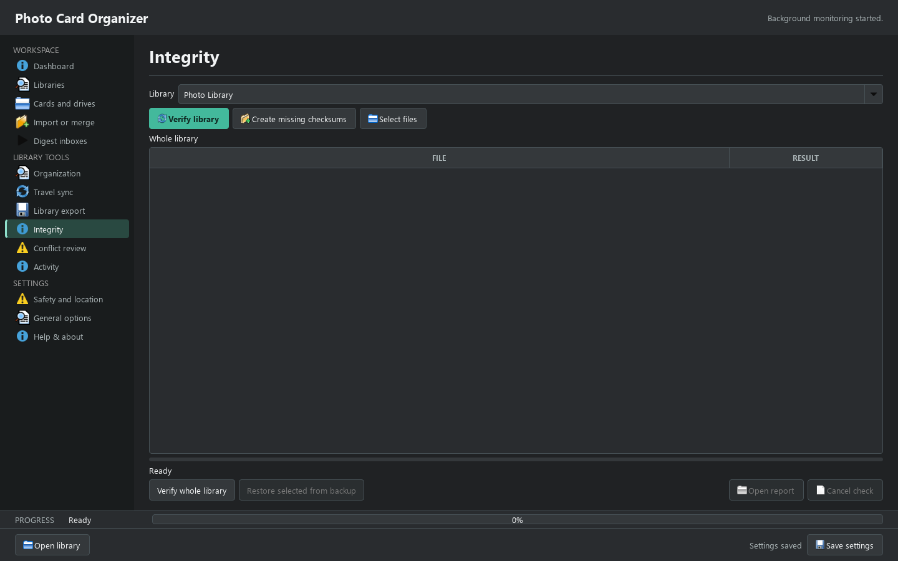
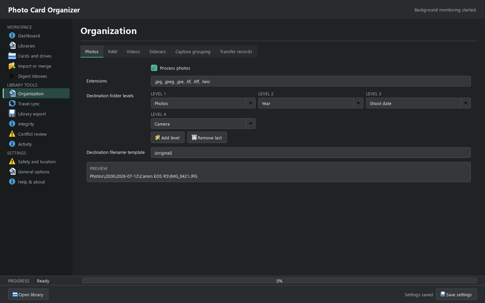

# Photo Card Organizer


**Import. Organize. Verify. Recover.**

Photo Card Organizer is a Windows and Linux desktop/tray application for safely
importing camera cards, folders, and existing photo collections into organized
libraries. Copy is the default; transfers between filesystems verify destinations
and required records before source deletion. In-place reorganization uses logged,
no-overwrite renames when the source and destination share a filesystem.

## Highlights

- Import multiple camera cards, ordinary folders, and varied existing libraries.
- Organize JPEG, RAW, video, and sidecar files from EXIF/XMP metadata.
- Use independent folder rules for date, month, day, camera, location, rating, media,
  named shoots, and high-confidence long-exposure brackets.
- Manage multiple local, removable, or OS-mounted network libraries and backups.
- Monitor retained Digest Inboxes, travel libraries, and shared USB/SMB/cloud
  folders without repeatedly copying unchanged files.
- Preserve exact duplicates and filename conflicts for paged, side-by-side review.
- Reorganize in place with an optional detailed preview and a final confirmation.
- Merge a library by content and migrate to a new folder with verified copying.
- Export media by type and capture-date range, with optional sidecars and groups.
- Keep matching portable and local per-session records with cryptographic checksums.
- Verify library integrity against stored baselines, or create missing checksums.
- Restore changed or missing files from checksum-matched backups while preserving damaged originals.
- Give each library its own folder and filename rules, or inherit global settings.
- Protect free-space reserves, interrupted work, migrations, and required replicas.
- Run through a dark PySide6 interface, system tray monitor, or Windows/Linux CLI.

## Release And Documentation

- [Release downloads](https://github.com/latexink/PhotoCardOrganizer/releases)
- [Version 0.11.0 user guide](output/pdf/PhotoCardOrganizer-0.11.0-User-Guide.pdf)
- [Changelog](CHANGELOG.md)
- [Roadmap](ROADMAP.md)
- [Release build and verification](PACKAGING.md)

Version 0.11.0 is an unsigned testing release. Use independent backups.



<details>
<summary>Integrity and organization screens</summary>




Screenshots show the actual application with disposable example configuration.
</details>

Libraries > Merge library previews content-based deduplication against the selected library using saved organization rules. Libraries > Migrate library verifies a copy, including metadata, to an empty folder before updating its location; originals remain for manual cleanup. Close other clients using either library first.

Version 0.11.0 adds manual verified recovery, per-library naming overrides, and unavailable-mount safeguards. A checksum detects corruption but cannot repair it alone: recovery requires a backup matching the saved baseline. Recovery currently checks the same relative path in configured backup roots. Scheduled checking, automatic backup catch-up, and a consolidated multi-source/clone wizard remain planned.

New configurations use 30-second connection checks and gradually reduce unchanged-card file scans to a configurable 300-second maximum. `Scan now` bypasses the delay. Saved intervals are preserved, and unchanged metadata and catalog records are reused to reduce disk activity.

<details>
<summary><strong>Technical and workflow reference</strong></summary>

## Source Layout

The configurable identity folder is placed at the card or drive root, outside `DCIM`:

```text
CARD_ROOT/
|-- .photocard/
|   |-- identity.json
|   `-- transfers/
|       `-- 2026/
|           `-- 2026-07/
|               |-- 2026-07-12_14-30-05_R5-Card_Studio-PC_a1b2c3d4.jsonl
|               `-- 2026-07-12_14-30-05_R5-Card_Studio-PC_a1b2c3d4.sha256
`-- DCIM/
```

The session filename, checksum filename, history folder levels, identity folder name, and identity filename are configurable. A portable session is created only when at least one transfer is recorded.

Matching records are saved locally under:

```text
DESTINATION/.photocard-organizer/transfer-records/CARD_ID/
```

The fast local index, pending-transfer recovery data, conflict-review queue, and place-name cache live at `DESTINATION/.photocard-organizer/manifest.sqlite3`. Versioned library identity and migration state live beside it in `library.json`.

## Install

### Windows package

Run `PhotoCardOrganizer-Installer-0.11.0.exe`. This is the separate installer/uninstaller; `PhotoCardOrganizer.exe` is the installed application launcher. The one offline installer contains the application, Python runtime, PySide6 dependencies, and versioned user guide, so client machines do not need Python or internet access. The unsigned Inno Setup wizard installs for the current Windows account without normally requiring administrator access. When it detects the same stable application ID, the installer offers Repair/Upgrade or Uninstall. The Start Menu group also includes `Uninstall Photo Card Organizer`; desktop and login-monitoring shortcuts remain selectable tasks.

Desktop and Start Menu shortcuts are selected by default on a new installation. Repairs and upgrades retain the saved shortcut choices; select Desktop shortcut in the wizard to add one to an existing installation. The application icon is included in launch shortcuts, the executable, installer, Installed Apps entry, application windows, and tray. Launch shortcuts share the application's Windows taskbar identity. Pinning to the taskbar remains a Windows user action.

Application settings are stored separately under `%APPDATA%\PhotoCardOrganizer`. Repair and upgrade operations preserve them. The uninstaller preserves settings, card profiles, and local application logs by default and asks before removing them. Imported media, destination transfer records, library manifests, and card identity/history folders are never uninstall targets.

### Linux packages

Install the Debian package with:

```bash
sudo apt install ./photo-card-organizer_0.11.0_amd64.deb
photo-card-organizer
```

Or make the AppImage executable and run it without installation:

```bash
chmod +x PhotoCardOrganizer-0.11.0-x86_64.AppImage
./PhotoCardOrganizer-0.11.0-x86_64.AppImage
```

Both packages expose the same CLI. Arguments are forwarded to the bundled executable, including `--scan-once`, `--dry-run`, folder imports, identity creation, settings import/export, autostart management, and explicit move confirmation. Debian upgrades preserve per-user configuration under `${XDG_CONFIG_HOME:-$HOME/.config}/PhotoCardOrganizer`; removing the package also leaves this data in place.

Tray behavior depends on the desktop environment exposing a status icon or AppIndicator, particularly under Wayland. ExifTool remains an optional system dependency for broader RAW and video metadata coverage.

### Developer install

Python 3.11 or newer is required.

Windows PowerShell:

```powershell
.\install.bat
.\PhotoCardOrganizer.bat
```

The same two files can be launched from File Explorer. `install.bat` validates a real Python 3.11+ interpreter instead of trusting the Microsoft Store app alias. If Python is missing and Windows Package Manager is available, it asks separately before installing Python 3.12 for the current user. It then creates `.venv`, reports completion, and waits for acknowledgement. `PhotoCardOrganizer.bat` starts the GUI and tray agent afterward without an extra console window.

To remove a developer environment rather than a packaged installation, close the application and run:

```powershell
.\uninstall.bat
```

The developer uninstaller removes the virtual environment, editable-install metadata, and login autostart entry, then verifies those removals. Per-user application data is preserved by default and has a separate removal confirmation. If `install.bat` added Python 3.12 through `winget`, `uninstall.bat` asks separately whether that shared runtime should also be removed. Imported media, destination transfer records, and `.photocard` identity/history folders are always preserved.

Linux:

```bash
sh install.sh
sh PhotoCardOrganizer.sh
```

The Linux developer installer detects Python 3.11+, creates or repairs `.venv`, installs PySide6 and the project, and verifies the application before reporting success. Run `sh uninstall.sh` to remove the managed environment and login autostart entry. Per-user application data is preserved unless separately selected for removal. Imported media, transfer records, and card identity folders are always preserved.

ExifTool is optional. When it is available on `PATH`, the app uses it for broader RAW and video metadata coverage. Files still transfer without ExifTool; unsupported metadata falls back to file modification time and the card identity.

Existing schema-1 through schema-4 configuration files are read by version 0.11.0. Before the application writes a migrated schema-5 file, it saves the original under the adjacent `backups` directory. Schema 5 retains the prior destination as a named default library and adds long-exposure organization settings. Library metadata upgrades separately back up older `library.json` files and atomically replace them. A configuration or library created by a newer, unsupported release is rejected without being rewritten.

## First Setup

1. Open `Libraries`, select `Set up library`, and choose where organized media should be stored. Connecting an existing Photo Card Organizer library does not scan, import, or move its media.
2. Open `Cards and drives`, select `Onboard card`, and choose a volume root such as `E:\` or `/media/alex/CANON_R5`.
3. Follow the wizard through card identity, destination, organization and safety, then review the concise initial-import summary.
4. Leave source-file handling as `Copy` initially. A move displays an additional checksum and source-deletion warning.
5. Select one or more connected rows on `Dashboard` with Ctrl or Shift, then select `Import selected cards`. Shared-destination work is queued sequentially and each card receives a separate transfer session.

Use `Import or merge` for files already on a hard drive, another managed library, a backup, or a removable transfer drive. The selected library is carried into the guided workflow, which shows one decision set at a time: choose the source and scan scope, choose the receiving library and organization, then review the exact operation, verification, and backups. The final `Save settings + Import` action shows the confirmation, saves the reviewed settings, and only then starts the scan. Copy and retain source files is the default; verified move remains an explicit destructive option.

`Analyze source folders` is optional and read-only. It previews at most 10,000 filesystem files to propose up to twelve editable per-media source levels. Reaching that preview limit never limits the import itself, which scans the complete selected scope. Changing the source scope invalidates the detected mapping instead of silently reusing stale assumptions. Folder imports use the same conflicts, replicas, verification, and move warning as cards, but never create an identity or history folder inside the source.

The `Backups and clones` tab accepts multiple output roots. A required destination must be verified before an import completes or a move source can be deleted. Optional destination failures are recorded as warnings while the primary import completes. Matching relative names and transfer-session IDs are used across the primary library and every replica.

Move cards are never processed destructively by the background scan. The settings window must be opened and the move confirmation accepted. CLI moves require the explicit `--confirm-move` flag.

## Digest Inboxes

`Digest inboxes` retains ordinary incoming folders that may contain varied hierarchy from other programs. An inbox can be a local staging folder, removable drive, UNC/SMB path, mounted network folder, or a locally synchronized Google Drive/other cloud folder. The source must be separate from the managed master library and enabled media use the same EXIF/XMP organization, filename, conflict, replica, retry, verification, and free-space rules as cards.

Copy is the default. The local SQLite manifest records each relative source path as pending, processed, failed, or conflict and skips an unchanged processed file on later scans, so an inbox does not create another copy every time it is checked. Copy leaves the incoming file in place; remove it later through the source application or operating system when appropriate. Automatic monitoring is available only for copy profiles.

This unchanged-source tracking is not yet a whole-library content fingerprint catalog. The same media arriving through a different historical path or after a folder-layout change can still require content-aware review. Library-wide SHA-256 reuse is recorded as planned work in `ROADMAP.md`.

Verified move is manual. The review dialog and a second warning must both be accepted. A source file is removed only after the primary destination, every required backup, cryptographic checksum, and required transfer records succeed. A failed or interrupted file remains at the source for retry. Move should not be used on a cloud-synchronized inbox unless remote deletion propagation is explicitly intended and separately backed up.

The queue table can be filtered by all, pending, processed, failed, or conflict state. It displays the latest 1,000 matching entries and labels that visible count against the complete retained total. Each manual digest run receives its own local run record, and the per-file history remains available after an inbox profile is forgotten.

## Travel Sync and Shared Hubs

`Travel sync` supports two return-home workflows:

- A retained direct source may be a laptop library, UNC path such as `\\FIELD-LAPTOP\Pictures\Travel Library`, or mounted travel drive. Its stable profile ID survives a changed mount path. Catching is always copy-only and the desktop manifest skips files it already handled.
- The `Shared hubs` tab accepts a removable USB drive, SMB/NAS folder, mounted network drive, or locally synchronized Google Drive/other cloud folder. The app works with the local folder exposed by the operating system; version 0.11.0 does not require or store direct Google API credentials.

Each hub profile has exactly one role on a client:

- `Publish` is intended for a travel laptop or other producer. Card imports can mirror into `HUB/Producers/CLIENT`, and `Publish now` verifies/reuses the entire local library to backfill work performed while the hub was offline.
- `Catch` is intended for the desktop master or another consumer. It scans every producer channel incrementally, never propagates deletion, and can poll automatically at a configurable interval.

After a catch is recorded in the local manifest, the consumer writes a matching local receipt and, when enabled, a shared receipt under `HUB/Receipts/CONSUMER/PRODUCER`. Producers can therefore see which consumers confirmed ingestion. Receipt failure never deletes or invalidates imported media; it remains visible as a warning and can be retried.

Use a separate producer channel for every laptop or SMB-capable tablet. A tablet that cannot run Photo Card Organizer may upload supported media into its assigned `Producers/TABLET` folder. A USB hub can be safely ejected after publication completes, then attached to a catch client; if its drive letter or mount point changes, edit the saved hub folder before running it. Keep clients in one role per hub to prevent circular publication. SMB authentication, Google Drive sign-in, offline-file availability, and cloud quota remain the responsibility of the operating system or sync client.

## Reorganize a Library

In `Libraries`, select a library and choose `Reorganize library`. Choose media types and a folder preset, such as `Separate by media type`. `Reorganize` calculates the plan and opens a final confirmation; `Preview changes` is optional and shows current/proposed paths first. Filenames are retained. Optional settings commit the layout for future imports and remove only previously scanned folders left empty.

Same-filesystem moves use no-overwrite renames without copying or hashing media. When every file in a folder maps to an unchanged relative layout, the whole folder can be renamed together. Unknown files prevent that shortcut. Cross-filesystem moves still hash during copying and compare the destination once before source deletion. Required backup copies and durable operation records are retained. Conflicts go to review, and interrupted rename catalog updates can resume without recopying files. Keep an independent backup.

`Create missing checksums for future integrity checks` is off by default. Enabling it reads previously unrecorded files once; known checksums follow renamed files without being recalculated. A rename is not an integrity check.

## Check Library Integrity

Open `Integrity` or `Libraries > Verify integrity`. Choose a library and optionally select individual files, then choose `Verify library`. Files are read once and compared with their saved checksum. The report distinguishes matching, changed, missing, and unrecorded files. Changed baselines are never silently replaced, and this operation does not repair media.

`Create missing checksums` establishes a baseline from current contents for unrecorded files only. It cannot establish whether a file was already damaged. Existing baselines are left untouched. A cancelled check saves completed results.

The portable catalog is `.photocard-organizer/integrity/catalog.sqlite3`; reports are in its `reports` subdirectory, with matching local reports under the application data directory. The older `.photocard-organizer/integrity.sqlite3` is migrated atomically when needed and retained as a rollback copy. Verification reports record checks without rewriting unchanged baselines. Do not compress the live SQLite catalog or its journal files; it needs normal random access and transactional writes.

## Export for Editing

Choose `Libraries > Export media` or select a named library in `Library export`. Filter by media type and an inclusive capture-date range, then select individual rows, all matching captures, or a detected group. Group expansion respects active filters, and matching sidecars are optional. Files sharing a stem and corresponding organized path are represented as one capture; media partitions such as `Photos`, `RAW`, and `Sidecars` are normalized. Scanning does not modify source files or change the default import library.

Exports are copy-only, use SHA-256 verification, honor the configured destination free-percent and free-GB reserves, preserve different-content filename conflicts with the configured suffix, and write a separate JSON Lines export-session record under `EDITING_FOLDER/.photocard-organizer/export-sessions`. Older root-level export records are migrated there when the folder is reused. Matching files already present are verified and reused. A source file that changes during export is reported and no partial copy is committed. The editing folder must neither be inside nor contain the managed master library.

## Folder Tokens

The interface provides simple dropdown levels. Custom values can also use these tokens:

| Token | Example |
| --- | --- |
| `{date:%Y}` | `2026` |
| `{date:%m - %B}` | `07 - July` |
| `{date:%Y-%m-%d}` | `2026-07-12` |
| `{camera}` | `Canon EOS R5` |
| `{location}` | `Asheville, North Carolina` |
| `{rating}` | `4 stars` |
| `{card}` | `R5 Card A` |
| `{media}` | `Raw` |
| `{capture_group}` | `Long Exposure Brackets` when a sequence qualifies; otherwise the level is omitted |
| `{source_dir:1}` | Preserve the source's first folder level |
| `{original}` | `IMG_0421.CR3` |
| `{stem}` | `IMG_0421` |
| `{ext}` | `cr3` |

Transfer-record names additionally support `{computer}`, `{session}`, `{instance}`, `{library}`, `{card_id}`, and `{algorithm}`.

## Safety Model

- Copy is the global and per-card default.
- Every copy is written to a temporary destination file and verified before final placement.
- After a crash or restart, the next write to that folder removes abandoned temporary files owned by the same client while leaving other clients' partial work alone.
- Files that change during a copy are deferred to a later scan; no partial destination is committed.
- Symbolic links, directory links, and Windows junctions are not followed during source discovery.
- Final placement is atomic and refuses to replace a name created by another process during transfer.
- Future-dated filesystem timestamps do not leave otherwise stable camera files skipped forever.
- Moves always use a cryptographic checksum; SHA-256 is the default.
- A move source is deleted only after destination verification and successful portable/local record writes.
- If the card history is read-only or full, the verified destination remains but the source is kept.
- Required replica or history failures leave a pending marker so the next attempt resumes the verified primary copy instead of creating another copy.
- Destination free-percent and free-GB limits block transfers before the configured reserve is crossed.
- A low source-free-percent threshold produces a warning but never silently changes copy into move.
- Existing files are never overwritten by a primary import. Both exact-content duplicates and different-content filename conflicts are preserved by default.
- Travel catches, hub catches, hub publication, and editing exports are copy-only with respect to their original libraries.
- Automatic Digest Inbox runs are copy-only; unchanged processed files are skipped rather than recopied.
- Hub producers use separate namespaces. Catch clients retain independent manifests and never interpret a remote deletion as an instruction.
- Digestion receipts are written only after the consumer manifest confirms the corresponding import.

## Conflicts, Space, and Errors

Different-content filename collisions never pause an import. The existing file remains in place, the incoming file is preserved under the configured local conflict-review folder, and the collision is queued for later review. Other safety decisions, such as low space or file errors, retain their configured unattended and manual behavior.

Same-name conflicts are classified by cryptographic content comparison. Different content is always preserved in the conflict-review folder; exact content supports `rename`, `conflict_folder`, and `skip`. Configurable appendages such as `_{number}` or ` ({number})` remain available for exact duplicates and repeated names inside the conflict folder. Conflict-folder placement retains the normal organized hierarchy below the configured conflict folder.

Every preserved conflict is added to `Conflict review`. The dark review screen shows existing and incoming files side by side, including previews where Pillow supports the format, size, modification time, paths, and review status. RAW files without a decodable preview still show their file details and can be opened externally. SQL-backed search and 200-record pages keep large queues bounded; rows support multi-selection and bulk review-status updates without modifying either media file.

Replica path conflicts are handled separately. The default blocks that replica. `archive_and_replace` moves its existing file under the replica's organized conflict area before writing and verifying the primary content, so the older replica file is also preserved.

Space policies support:

- `fallback_then_block`: try configured fallback destinations, then stop that file safely.
- `block`: keep the source and do not cross the configured reserve.
- `continue_below_reserve`: allow an unattended transfer below the percentage/GB reserve only when the drive still has enough physical space.

A manual low-space prompt offers Continue below reserve, Choose another destination, Skip file, or Stop this card. A physically full destination never offers Continue. An alternate destination can be used once or saved as the new default; already completed files remain recorded, and the remaining files continue in a new session.

File I/O and checksum failures use configurable retry count and delay settings. After retries, manual imports offer Retry, Choose another destination, Skip, or Stop. Background behavior can continue with the next file or stop the card. Temporary files are removed after a failed copy, a failure in one file does not corrupt other session records, and move sources are retained whenever verification or required logging is incomplete.

Handled cases include a card or destination being disconnected, permission errors, destination exhaustion, checksum mismatch, malformed identity/history records, read-only card history, unsupported/corrupt metadata, online location failure, and a file that is still being written. Metadata and location failures fall back offline; transfer-integrity failures do not.

Online place-name lookup is off by default. When enabled, GPS coordinates are sent to the configured provider. Nominatim requests are rate-limited to one per second and cached locally.

## First Real-World Backup Test

1. Use only the backup copy as the source and choose a new, empty destination on a different path. Keep every source-file action set to `Copy`.
2. Keep Camera override blank for a mixed-camera library. Start with `Date then camera` and use `{date:%Y%m%d_%H%M%S}_{original}` for enabled media filename templates; camera model alone is not unique across two bodies of the same model.
3. Disable automatic hub catch and optional replicas for the first local test. Set copy verification to SHA-256 and set free-space reserves appropriate for the test destination.
4. Import a small representative folder first: JPEG, RAW, matching sidecar, video, duplicate content, and one same-name/different-content pair.
5. Confirm the review summary shows the expected source, destination, media types, organization, `Copy`, and required backups before accepting.
6. Compare source and destination file counts, open samples from every media class, and review Activity, transfer-session JSONL, checksum records, conflicts, and `manifest.sqlite3`.
7. Run the same source a second time. Expected result: zero new imports for the same retained source identity and all stable files reported as already handled.
8. Test editing export into a separate empty folder, then verify its JSONL record and open the exported JPEG, RAW, video, and sidecar files.
9. Add one optional USB, SMB, or synchronized-folder hub. Publish, catch it into another empty test library, confirm the digestion receipt, then repeat the catch and expect zero duplicate imports.
10. Add a copy-only Digest Inbox with a nested sample folder. Digest it twice, expect zero additional files on the second pass, then inspect its processed queue.
11. Enable automatic monitoring only after these manual copy-only checks pass. Do not test `Move` until a separate disposable source set has passed checksum, log, required-backup, interruption, and reconnect tests.

## Review Notes

- Optional ordinary replica failures are reported without blocking the primary import and are not automatically queued. Publish-role Transfer Hubs provide explicit verified backfill for travel workflows.
- Cross-computer source identity uses card ID, relative path, size, and modification time. A different file deliberately restored with the exact same size and timestamp can be treated as already handled; a future content-fingerprint mode would close that gap.
- Cloud-sync clients may expose placeholders or report local free space rather than remote quota. Unavailable/placeholding files remain warnings; verify cloud "available offline" settings before unattended catch.
- Before unattended production use, exercise long Windows paths, SMB permissions, cloud-synced folders, USB removal/ejection, changed drive letters or mount points, sleep/resume, and physical card removal with the actual cameras, readers, and backup drives in use.

## Commands

```text
python app.py                         Open the desktop application
python app.py --service               Start hidden in the tray
python app.py --scan-once --dry-run   Preview connected-card work
python app.py --scan-once             Import copy cards once
python app.py --scan-once --confirm-move
python app.py --import-folder D:\Incoming --import-name "Travel drive"
python app.py --import-folder /mnt/incoming --no-subfolders
python app.py --import-folder /mnt/incoming --card-action move --confirm-move
python app.py --digest-inbox legacy-drop
python app.py --digest-all
python app.py --digest-inbox disposable-move --confirm-move
python app.py --export-settings PhotoCardOrganizer-client-settings.json
python app.py --import-settings PhotoCardOrganizer-client-settings.json
python app.py --install-autostart      Start the tray agent at login
python app.py --init-config            Create the default config
python app.py --version                Print the installed version
```

For an installed Linux package, replace `python app.py` with `photo-card-organizer`. For an AppImage, replace it with the AppImage path; for example:

```bash
photo-card-organizer --scan-once --dry-run
photo-card-organizer --import-folder /mnt/camera-backup --no-subfolders
./PhotoCardOrganizer-0.11.0-x86_64.AppImage --print-config
```

Create an identity folder without the GUI:

```text
python app.py --create-identity E:\ --card-name "Canon R5 Card A" --card-id canon-r5-a
```

## Verification

Run the focused cross-platform tests with:

```text
python -m unittest discover -s tests -v
```

The suite exercises mixed media, EXIF organization, shared history across computers, folder recursion, retained card/travel/Digest Inbox profiles, verified moves, configurable SHA-512 logs, matching local records, required and optional replicas, transfer-hub publication/catch/receipts/backfill, digest repeat safety and background polling, editing export, capture grouping, retry resumption, exact and filename conflicts, large conflict paging/search/bulk review, portable settings, fallback destinations, hard-space refusal, transient I/O retries, source mutation, destination races, inaccessible network paths, future timestamps, multi-card Qt selection, taskbar icon assets, UI tooltips, existing-structure detection, and cross-process single-instance activation.

Release build and verification instructions are in [PACKAGING.md](PACKAGING.md).

</details>
