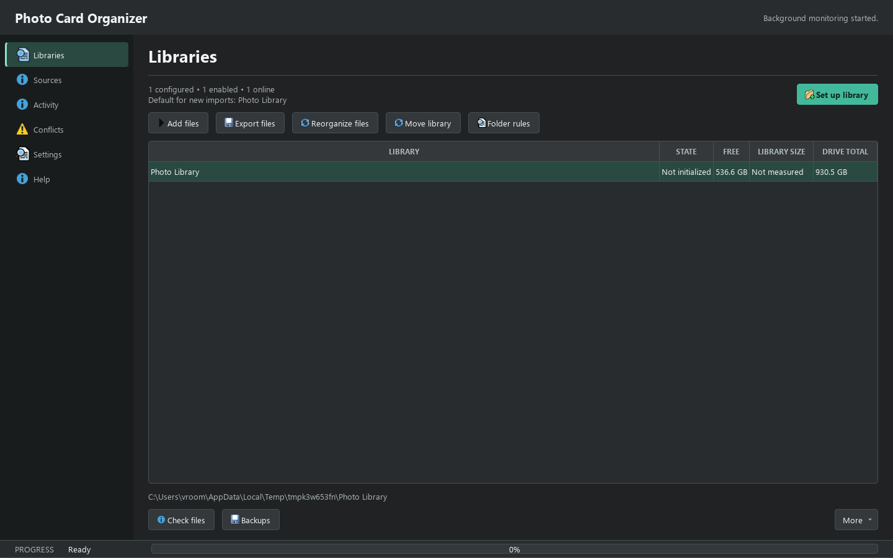
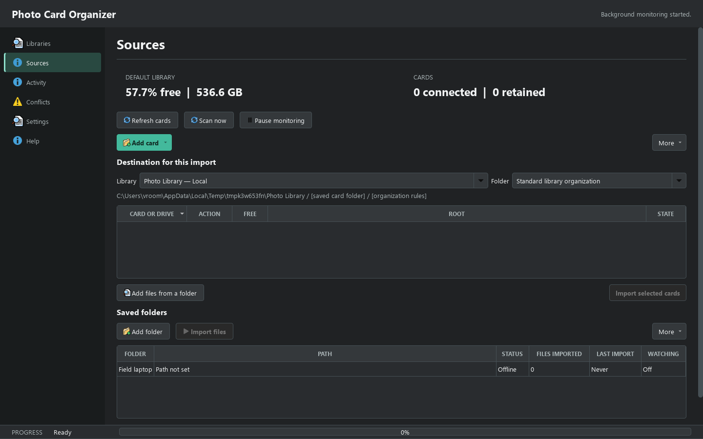

# Photo Card Organizer


**Keep your photos and videos in order.**

Bring files from camera cards, folders and older collections into organized
libraries. Choose folder rules, keep backup copies and review conflicting files
without overwriting them. Windows and Linux are supported, with a desktop window
and optional background monitoring.

## What It Does

- Imports JPEG, RAW, videos and companion files such as XMP sidecars.
- Organizes by date, camera, location, rating or your own folder rules.
- Keeps photos and videos together or in separate libraries with different layouts.
- Combines collections, reorganizes files or moves a library to another drive.
- Preserves conflicting files for side-by-side review.
- Copies to multiple backups, including removable and mounted network drives.
- Imports from laptop folders, USB drives and locally synced cloud folders.
- Exports selected files or a date range for editing.
- Offers manual checksum checks and recovery from a matching backup.

## Current Preview

**0.12.0.dev2** simplifies the menus and folder-import workflow. This is a source
preview, not a new installer. The latest packaged preview is **0.12.0.dev1**;
its menus differ from the screenshots and guide below.

[Downloads](https://github.com/latexink/PhotoCardOrganizer/releases) ·
[Current PDF guide](output/pdf/PhotoCardOrganizer-0.12.0.dev2-User-Guide.pdf) ·
[Changelog](CHANGELOG.md) · [Roadmap](ROADMAP.md)



## Where To Start

| Page | Use it to |
| --- | --- |
| **Libraries** | Set up a library, add or export files, edit its folder rules, reorganize or move it, and check files. |
| **Sources** | Set up camera cards, save incoming folders and import new files. |
| **Activity** | See recent messages or open saved transfer records. |
| **Conflicts** | Compare files kept aside because their intended destinations already exist. |
| **Settings** | Change monitoring, default folder rules, backups and other preferences. |
| **Help** | Open the guide, diagnostics, changelog and installation tools. |

To combine collections, select the receiving library and choose **Add files**.
Choose the source folder, media types and layout, then review the final summary.
These choices apply to that import only unless you select **Save these folder
rules for this library**. Existing files in the receiving library stay where
they are; use **Reorganize files** to apply a layout to them.

Old laptop-folder profiles remain usable in Sources. They do not need a separate
travel-library workflow. Shared-folder publishing and receipts remain optional
under **Advanced > Shared folder options**. Network drives must already be mounted
and authenticated through your operating system.



## Copies, Moves And File Checks

Card and folder imports default to **Copy**. Moving a library defaults to **Move**,
with **Copy and keep originals** available. File changes require confirmation.
Moves keep sources if required copies, backups or records fail.

Normal transfers check completion, file sizes and whether the source changed.
Compatible same-filesystem moves can rename files without reading their contents.
These checks do **not** detect corruption that leaves a file the same size. Use
**Check files** to create or verify saved checksums, compare with a backup or
restore a file from a matching copy. A checksum detects damage; it cannot repair
missing data on its own.

Content comparisons happen only when destination paths conflict. Files with
different names are not automatically deduplicated across the whole library.
Conflicts are kept locally for review and excluded from exports by default.

Keep an independent backup, especially while testing a preview. This release is
not a confirmed fix for the native 0.11.2 crashes. Previous installer lifecycle
checks were limited by Sandbox Application Control; see the
[packaged-preview validation record](docs/VALIDATION-0.12.0.dev1.md).

## Run From Source

Python 3.11 or newer is required. From the repository folder:

```powershell
py -m venv .venv
.\.venv\Scripts\python.exe -m pip install -e .
.\.venv\Scripts\python.exe app.py
```

On Linux:

```bash
python3 -m venv .venv
.venv/bin/python -m pip install -e .
.venv/bin/python app.py
```

The command-line interface is available through `photo-card-organizer --help`
or `python app.py --help` in the active environment. Optional ExifTool improves
RAW and video metadata support; transfers still work without it.

For Windows packaging and Linux build instructions, see [PACKAGING.md](PACKAGING.md).
For menu and documentation conventions, see [Interface wording](docs/interface-wording.md).
Historical guides are retained; use the guide matching your version.
